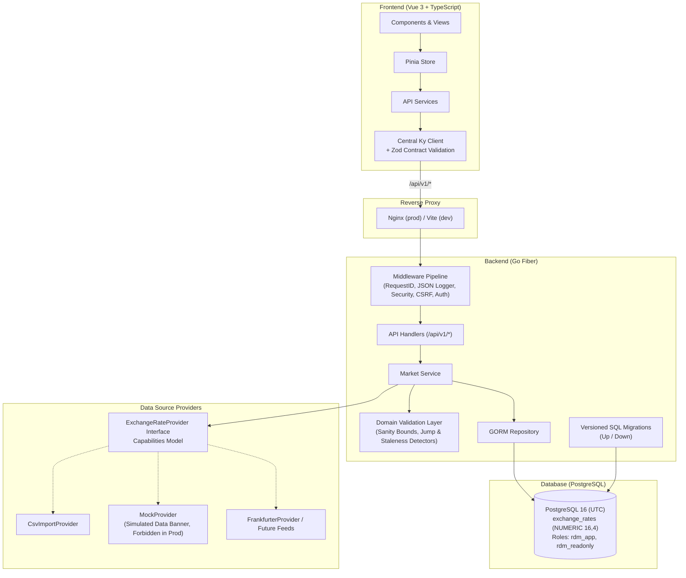

# RdMarket Intelligence

> USD/IDR Financial Market Monitoring and Statistical Analysis Platform. Phase 0: Foundation.

RdMarket Intelligence is an analytical monitoring platform for the US Dollar to Indonesian Rupiah (USD/IDR) currency pair. Phase 0 delivers the architectural and infrastructure foundation: versioned migrations, central typed configuration with production guard rails, OpenAPI contract verification, provider abstraction with data-quality validation, admin authentication, and design token integration.

It is strictly an **analytical monitoring tool**. It reports what stored historical and current data show without fabricating values, predicting certainty, or offering trading advice.

---

## 1. Architecture



### Layering Rules
- **Backend**: `Handler -> Service -> Repository -> Database`. External data flows: `Service -> Provider -> External API`. Handlers remain thin; domain logic is pure and unit-tested without a database.
- **Frontend**: `Component -> Composable -> Pinia store -> API service -> Ky -> Go API`. Chart components receive props and never fetch data directly.

---

## 2. Technology Stack (Fixed)

- **Frontend**: Vue 3 (Composition API, `<script setup>`), TypeScript (strict), Vite, Pinia, Vue Router, Tailwind CSS, Ky, Zod, Highcharts.
- **Backend**: Go, GoFiber v2, GORM, PostgreSQL 16.
- **Testing**: Go unit/integration/contract suites, Node/TSX test runner, Playwright E2E.
- **Infrastructure**: Docker, Docker Compose, GitHub Actions.
- **Forbidden**: React, Next.js, Nuxt, Laravel, Node.js backend, Firebase, GORM AutoMigrate, and floating-point types for monetary values.

---

## 3. Quick Start

### Prerequisites
- Docker & Docker Compose
- Go 1.22+ (for local development)
- Node.js 22+ (for local frontend development)

### Local Development Setup
```bash
# 1. Copy environment template
cp .env.example .env

# 2. Start services in Docker
make compose-up

# 3. Apply versioned database migrations
make migrate-up

# 4. Access application
# Frontend: http://localhost:3000
# Backend API: http://localhost:8080/api/v1/health
```

---

## 4. Make Targets

| Target | Description |
|---|---|
| `make setup` | Install frontend dependencies (`npm ci`) and download Go modules |
| `make dev` | Launch development containers with live reload |
| `make build` | Build backend binary and frontend production bundle |
| `make test` | Run backend unit tests and frontend test suite |
| `make lint` | Run Go formatting/vetting and frontend TypeScript verification |
| `make contract-check` | Execute automated contract tests against `docs/openapi.yaml` |
| `make migrate-up` | Apply pending versioned SQL migrations |
| `make migrate-down` | Roll back the latest database migration |
| `make seed-dev` | Seed development dataset (forbidden in production) |
| `make e2e` | Run Playwright E2E smoke tests |
| `make compose-up` | Start Docker Compose in detached mode |
| `make compose-down` | Stop Docker Compose containers |

---

## 5. Configuration & Guard Rails

Configuration is loaded centrally from environment variables with fail-fast validation at startup (`backend/internal/config/config.go`):

| Variable | Description | Default |
|---|---|---|
| `APP_ENV` | Environment (`development`, `test`, `production`) | `development` |
| `PORT` | HTTP server port | `8080` |
| `DATABASE_URL` | PostgreSQL connection string | Required in production |
| `EXCHANGE_RATE_PROVIDER` | Active feed provider (`mock`, `frankfurter`, `csv`) | `mock` |
| `ADMIN_USERNAME` | Admin authentication username | `admin` |
| `ADMIN_PASSWORD_HASH` | Bcrypt password hash for admin | Required in production |
| `SESSION_SECRET` | Secret key for signed cookies / tokens (min 32 chars in prod) | Required in production |
| `AUTH_REQUIRE_READ` | Protect read-only endpoints with authentication | `false` |
| `CORS_ALLOWED_ORIGINS` | Explicit permitted CORS origins | `http://localhost:3000` |

### Environment Guard Rails
- **Production Rejection**: The server refuses to start if `APP_ENV=production` and `EXCHANGE_RATE_PROVIDER=mock`.
- **Simulated Banner**: When `MockProvider` is active in development or testing, API responses set `meta.simulated = true`, and the UI displays a persistent, non-dismissible `SIMULATED DATA` banner.
- **Credential Protection**: `RedactedDump()` masks database passwords, API keys, password hashes, and session secrets in startup logs.

---

## 6. Database Foundation & Conventions

- **Migrations**: Versioned SQL migrations located in `backend/internal/migrations/sql/` manage all DDL. GORM `AutoMigrate` is prohibited.
- **Timestamps**: Stored strictly as `TIMESTAMPTZ` in UTC.
- **Rates**: Stored as `NUMERIC(16, 4)` to eliminate floating-point precision error.
- **Roles**:
  - `rdm_app`: Application role with read/write table privileges.
  - `rdm_readonly`: Analytical role with read-only table privileges.
- **PgBouncer**: Designed for transaction pooling (no session-level locks or cross-transaction prepared statements).

---

## 7. Data Quality & Provider Abstraction

The `ExchangeRateProvider` interface enforces a strict capability model:
```go
type Capabilities struct {
    SupportsIntraday bool   `json:"supports_intraday"`
    SupportsHistory  bool   `json:"supports_history"`
    MaxHistoryDays   int    `json:"max_history_days"`
    Granularity      string `json:"granularity"`
    RateLimit        string `json:"rate_limit"`
    RequiresAPIKey   bool   `json:"requires_api_key"`
    LicenseNote      string `json:"license_note"`
}
```

The domain validation layer (`backend/internal/domain/validation.go`) evaluates incoming observations without database dependencies:
1. **Sanity Bounds**: Verifies rate is within plausible bounds (e.g. 5,000 to 35,000 IDR).
2. **Jump Detection**: Flags observations exceeding configurable daily jump percentages (e.g. >10%) as `quality_status = 'suspect'`.
3. **Staleness Detection**: Identifies gaps exceeding publication lags.
4. **Sequence Validation**: Detects duplicate or out-of-order timestamps. Suspicious data is never silently trusted or dropped.

---

## 8. API Contract & OpenAPI Specification

- `docs/openapi.yaml` (OpenAPI 3.1) is the single source of truth.
- Standard response envelope: `{ data, meta, error }`.
- Error code registry in Go (`backend/internal/errors/codes.go`) synchronizes directly with TypeScript union types (`frontend/src/types/errors.ts`).
- `make contract-check` validates live handler responses against the OpenAPI specification.

---

## 9. CI / CD Quality Gates

GitHub Actions workflows in `.github/workflows/` enforce the Phase 0 status checks:
- `backend` (`backend.yml`): Formatting (`gofmt`), vetting (`go vet`), `golangci-lint`, race-enabled tests, PostgreSQL service container integration tests, migration rollback verification, binary build.
- `frontend` (`frontend.yml`): Clean installation (`npm ci`), TypeScript type-check, unit tests, production build.
- `repo-checks` (`repo-checks.yml`): Foundation files verification, secrets scan, forbidden attribution scan, Docker Compose config validation.
- `e2e` (`e2e.yml`): Playwright smoke tests against the compose profile.
- `docker` (`docker.yml`): Validates multi-stage Dockerfile builds for frontend and backend.

---

## 10. Roadmap

- **Phase 0 (Current)**: Foundation & Infrastructure (No product features).
- **Phase 1**: Market Monitoring (USD/IDR real ingestion, statistics, interactive charting).
- **Phase 2**: Forecasting & Backtesting (Python service integration, prediction intervals).
- **Phase 3**: Economic Indicators + Alerts & Market Intelligence (Outbox notifications, Macro feeds).
- **Phase 4**: Production Monitoring & Optimization (PgBouncer, metrics, budgets).
- **Phase 5**: Deployment, Security Hardening & Release (GHCR, hardened Compose, drills).