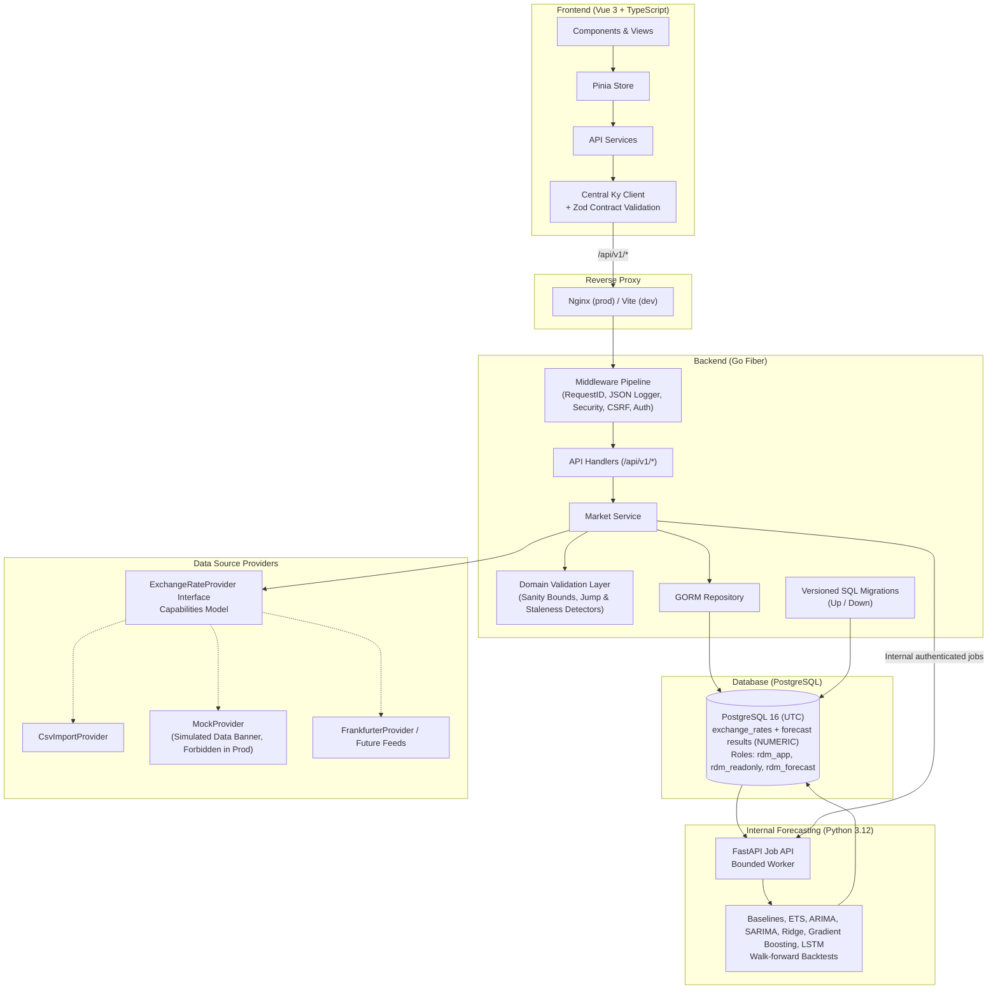

# RdMarket Intelligence

> USD/IDR Financial Market Monitoring and Statistical Analysis Platform. Phase 2: Forecasting & Backtesting.

RdMarket Intelligence is an analytical monitoring platform for the US Dollar to Indonesian Rupiah (USD/IDR) currency pair. The platform includes the Phase 0 foundation, Phase 1 market monitoring, and Phase 2 statistical forecasting and backtesting.

It is strictly an **analytical monitoring tool**. It reports what stored historical and current data show without fabricating values, predicting certainty, or offering trading advice.

Phase 1 provides the USD/IDR market-monitoring workflow: provider-backed ingestion and
backfill, current and historical observations, descriptive statistics, SMA and
rolling-volatility indicators, transparent market-condition labels, data-source
status, and the Vue dashboard views. Phase 2 adds an internal Python forecasting
service and walk-forward evaluation. Economic indicators, alerts, briefs, and
other later-phase features are intentionally not included.

---

## 1. Architecture



### Layering Rules
- **Backend**: `Handler -> Service -> Repository -> Database`. External data flows: `Service -> Provider -> External API`. Handlers remain thin; domain logic is pure and unit-tested without a database.
- **Frontend**: `Component -> Composable -> Pinia store -> API service -> Ky -> Go API`. Chart components receive props and never fetch data directly.

---

## 2. Technology Stack (Fixed)

- **Frontend**: Vue 3 (Composition API, `<script setup>`), TypeScript (strict), Vite, Pinia, Vue Router, Tailwind CSS, Ky, Zod, Highcharts.
- **Backend**: Go, GoFiber v2, GORM, PostgreSQL 16.
- **Testing**: Go unit/integration/contract suites, Node/TSX test runner, Playwright E2E.
- **Infrastructure**: Docker, Docker Compose, GitHub Actions.
- **Forbidden**: React, Next.js, Nuxt, Laravel, Node.js backend, Firebase, GORM AutoMigrate, and floating-point types for monetary values.

---

## 3. Quick Start

### Prerequisites
- Docker & Docker Compose
- Go 1.22+ (for local development)
- Node.js 22+ (for local frontend development)

### Local Development Setup
```bash
# 1. Copy environment template
cp .env.example .env

# 2. Start services in Docker
make compose-up

# 3. Apply versioned database migrations
make migrate-up

# 4. Access application
# Frontend: http://localhost:3000
# Backend API: http://localhost:8080/api/v1/health
```

---

## 4. Make Targets

| Target | Description |
|---|---|
| `make setup` | Install frontend dependencies (`npm ci`) and download Go modules |
| `make dev` | Launch development containers with live reload |
| `make build` | Build backend binary and frontend production bundle |
| `make test` | Run backend unit tests and frontend test suite |
| `make lint` | Run Go formatting/vetting and frontend TypeScript verification |
| `make contract-check` | Execute automated contract tests against `docs/openapi.yaml` |
| `make forecasting-test` | Run the Python forecasting service tests |
| `make migrate-up` | Apply pending versioned SQL migrations |
| `make migrate-down` | Roll back the latest database migration |
| `make seed-dev` | Seed development dataset (forbidden in production) |
| `make e2e` | Run Playwright E2E smoke tests |
| `make compose-up` | Start Docker Compose in detached mode |
| `make compose-down` | Stop Docker Compose containers |

---

## 5. Configuration & Guard Rails

Configuration is loaded centrally from environment variables with fail-fast validation at startup (`backend/internal/config/config.go`):

| Variable | Description | Default |
|---|---|---|
| `APP_ENV` | Environment (`development`, `test`, `production`) | `development` |
| `PORT` | HTTP server port | `8080` |
| `DATABASE_URL` | PostgreSQL connection string | Required in production |
| `EXCHANGE_RATE_PROVIDER` | Active feed provider (`mock`, `frankfurter`, `csv`) | `mock` |
| `ADMIN_USERNAME` | Admin authentication username | `admin` |
| `ADMIN_PASSWORD_HASH` | Bcrypt password hash for admin | Required in production |
| `SESSION_SECRET` | Secret key for signed cookies / tokens (min 32 chars in prod) | Required in production |
| `AUTH_REQUIRE_READ` | Protect read-only endpoints with authentication | `false` |
| `CORS_ALLOWED_ORIGINS` | Explicit permitted CORS origins | `http://localhost:3000` |
| `INGESTION_INTERVAL_MINUTES` | Minimum interval between scheduled provider syncs | `15` |
| `HISTORY_POINT_LIMIT` | Maximum points returned for a history request | `1500` |

### Environment Guard Rails
- **Production Rejection**: The server refuses to start if `APP_ENV=production` and `EXCHANGE_RATE_PROVIDER=mock`.
- **Simulated Banner**: When `MockProvider` is active in development or testing, API responses set `meta.simulated = true`, and the UI displays a persistent, non-dismissible `SIMULATED DATA` banner.
- **Credential Protection**: `RedactedDump()` masks database passwords, API keys, password hashes, and session secrets in startup logs.

Forecast-specific variables are documented in the [configuration table](#11-forecasting--backtesting). Forecast runs only use stored accepted USD/IDR observations. Missing dates remain gaps; values are not forward-filled or interpolated.

## 10. Phase 1 market data

The backend exposes the following read endpoints under `/api/v1`:

- `GET /market/usdidr/current`
- `GET /market/usdidr/history?range=1D|7D|1M|3M|6M|1Y|5Y`
- `GET /market/usdidr/statistics`
- `GET /market/usdidr/indicators?range=...`
- `GET /market/usdidr/condition?range=...`
- `GET /data-sources`

The server performs the initial backfill when the database has no USD/IDR
observations and then runs a single in-process sync scheduler. A provider error
does not replace stored data or generate a fallback series; the API continues
serving stored observations and reports the degraded source state.

Previous close is the last accepted observation before the latest observation.
Weekly and monthly changes use the latest accepted observation on or before the
corresponding calendar boundary. SMA values use a warm-up window and remain
missing until enough accepted observations exist. Rolling volatility is the
sample standard deviation of daily log returns over 30 observations; no
annualization is applied. Suspect and rejected observations are excluded from
calculations.

Condition labels are descriptive rules only: the short-term label uses the
7-day return, the trend label uses the 30-day return and SMA 30, and the
volatility label compares rolling volatility with the configured low and high
limits. The UI repeats: “Descriptive statistics only. Not financial advice.”

## 11. Forecasting & Backtesting

The forecasting service is internal to the Compose network. Browser requests go
through the Go API; the Python service has no published port. PostgreSQL stores
forecast jobs, run metadata, interval forecasts, walk-forward predictions, and
long-form evaluation metrics. The service's `rdm_forecast` role can read
accepted exchange observations and write forecasting tables only. A fresh
development database provisions the login role using
`deploy/postgres/init-forecast-role.sh`; on an existing database, provision a
dedicated login for the existing `rdm_forecast` role before applying the
migration: use a privileged database session to set `LOGIN` and install the
password from the deployment secret store. Never give this service the
application or superuser credentials.

### Modeling and horizons

The daily-close modeling series consists of accepted observations on their
observed business-day timestamps. Suspect and rejected rows are excluded.
Weekends and other missing observations remain absent; the system records a gap
count and never fills or interpolates them. Horizon values (1, 5, 10, 21, 63)
are observation steps on that index, not fabricated calendar-day quotes.

Models use log rates by default, then transform forecast points and interval
bounds back to the exchange-rate scale. This keeps the fitted values positive
and models proportional changes; it does not remove structural breaks or
external factors. Naive (last observation), drift, and seasonal-naive
baselines are mandatory. ETS, bounded training-only AIC ARIMA search, capped
SARIMA search, experimental Ridge and Gradient Boosting on lagged log-returns,
and an experimental Keras/TensorFlow LSTM are available. Ridge/Gradient
Boosting scaler fits and LSTM validation/scaler fits use only each training
window. ML availability is reported by the model catalog; uninstalled models
are disabled rather than silently replaced. Each forecast carries 80% and 95% prediction intervals,
training metadata, code/model version, and a fingerprint of the exact input
series. Insufficient history fails the job with `INSUFFICIENT_DATA`.

### Backtesting and metrics

Backtests use expanding windows by default, with rolling windows available.
Folds are chronological; each model is fitted only with observations at or
before that fold's forecast origin. Baselines share exactly the same folds as
statistical models. LSTM uses a configurable `refit_every_n_folds` cadence and
model-specific fold cap to bound CPU cost; both are recorded with each run.
Available measures include MAE, RMSE, guarded MAPE, sMAPE,
MASE, directional accuracy, 95% interval coverage, mean interval width, and
skill score versus naive (`1 - model error / naive error`). A positive skill
score indicates lower error than the naive reference on those stored folds.
Metrics describe historical out-of-sample results and do not imply future
performance. A Diebold-Mariano significance test is not implemented; the UI
does not claim statistical significance.

### API

Forecast API paths are under `/api/v1/forecast/usdidr`:

- `GET /models`, `GET /latest?model=&horizon=`, `GET /runs/{id}`
- `GET /jobs`, `POST /jobs` (authenticated), `GET /jobs/{id}`
- `GET /backtests`, `GET /backtests/{id}`,
  `GET /backtests/{id}/predictions`
- `GET /leaderboard?horizon=`

The leaderboard includes available baselines and skill score versus naive. If
there is no completed result, the response contains no synthetic rows. If a
model does not outperform the naive baseline, that is stated plainly.

### Forecast configuration

| Variable | Description | Development default |
|---|---|---|
| `FORECAST_SERVICE_URL` | Internal Python service URL | `http://forecasting:8000` |
| `FORECAST_DB_USER` | Dedicated forecast database role | `rdm_forecast` |
| `FORECAST_DB_PASSWORD` | Password for that role; keep in local `.env` or secret store | Local-only example |
| `FORECAST_DB_HOST` / `FORECAST_DB_PORT` / `FORECAST_DB_NAME` | Forecast database endpoint | `postgres` / `5432` / `rdmarket` |
| `FORECAST_MAX_CONCURRENT_JOBS` | Maximum active jobs / worker bound | `2` |
| `FORECAST_JOB_TIMEOUT_SECONDS` | Per-job execution deadline | `900` |
| `FORECAST_SCHEDULER_ENABLED` | Daily schedule switch; disabled by default | `false` |
| `FORECAST_DEFAULT_INTERVALS` | Prediction interval levels | `0.8,0.95` |
| `FORECAST_INTERNAL_TOKEN` | Shared Go/Python internal API token; use a strong value in deployment | Local-only example |
| `FORECAST_INSTALL_ML` / `FORECAST_ENABLE_ML` | Install/enable the optional ML dependency group | `true` |
| `FORECAST_RANDOM_SEED` | Reproducible model seed | `42` |
| `FORECAST_LSTM_MAX_EPOCHS` / `FORECAST_LSTM_WINDOW` | LSTM training limits and return window | `40` / `20` |
| `FORECAST_LSTM_LAYERS` / `FORECAST_LSTM_UNITS` | LSTM depth (1–2) and units (32–64) | `1` / `32` |
| `FORECAST_LSTM_DROPOUT` / `FORECAST_LSTM_LEARNING_RATE` | LSTM regularization and optimizer rate | `0.1` / `0.001` |
| `FORECAST_LSTM_BATCH_SIZE` | LSTM batch size | `32` |
| `FORECAST_LSTM_REFIT_EVERY_N_FOLDS` | Refit cadence for LSTM backtests | `5` |
| `FORECAST_LSTM_MAX_FOLDS` | Maximum LSTM backtest folds | `20` |

The LSTM uses one or two configurable layers, a chronological validation split,
training-only scaling, and recursive multi-step forecasts. Its prediction
intervals use empirical absolute validation-residual quantiles scaled by the
square root of the forecast step; they are approximations, not exact
probabilistic intervals. The final model is refit on the complete training
window for the selected early-stopping epoch count. Statistical and ML models
may fail to outperform Naive, and model performance can change after structural
breaks.

`forecasting` resource limits are one CPU and 3 GiB memory when ML/LSTM is
installed (the optional ML build also increases the image size). The service health
check uses its internal `/health` endpoint. A forecasting outage does not block
or disable Phase 1 market endpoints; forecast requests return a structured
degraded-service response.

---

## 6. Database Foundation & Conventions

- **Migrations**: Versioned SQL migrations located in `backend/internal/migrations/sql/` manage all DDL. GORM `AutoMigrate` is prohibited.
- **Timestamps**: Stored strictly as `TIMESTAMPTZ` in UTC.
- **Rates**: Stored as `NUMERIC(16, 4)` to eliminate floating-point precision error.
- **Roles**:
  - `rdm_app`: Application role with read/write table privileges.
  - `rdm_readonly`: Analytical role with read-only table privileges.
- **PgBouncer**: Designed for transaction pooling (no session-level locks or cross-transaction prepared statements).

---

## 7. Data Quality & Provider Abstraction

The `ExchangeRateProvider` interface enforces a strict capability model:
```go
type Capabilities struct {
    SupportsIntraday bool   `json:"supports_intraday"`
    SupportsHistory  bool   `json:"supports_history"`
    MaxHistoryDays   int    `json:"max_history_days"`
    Granularity      string `json:"granularity"`
    RateLimit        string `json:"rate_limit"`
    RequiresAPIKey   bool   `json:"requires_api_key"`
    LicenseNote      string `json:"license_note"`
}
```

The domain validation layer (`backend/internal/domain/validation.go`) evaluates incoming observations without database dependencies:
1. **Sanity Bounds**: Verifies rate is within plausible bounds (e.g. 5,000 to 35,000 IDR).
2. **Jump Detection**: Flags observations exceeding configurable daily jump percentages (e.g. >10%) as `quality_status = 'suspect'`.
3. **Staleness Detection**: Identifies gaps exceeding publication lags.
4. **Sequence Validation**: Detects duplicate or out-of-order timestamps. Suspicious data is never silently trusted or dropped.

---

## 8. API Contract & OpenAPI Specification

- `docs/openapi.yaml` (OpenAPI 3.1) is the single source of truth.
- Standard response envelope: `{ data, meta, error }`.
- Error code registry in Go (`backend/internal/errors/codes.go`) synchronizes directly with TypeScript union types (`frontend/src/types/errors.ts`).
- `make contract-check` validates live handler responses against the OpenAPI specification.

---

## 9. CI / CD Quality Gates

GitHub Actions workflows in `.github/workflows/` enforce the Phase 0 status checks:
- `backend` (`backend.yml`): Formatting (`gofmt`), vetting (`go vet`), `golangci-lint`, race-enabled tests, PostgreSQL service container integration tests, migration rollback verification, binary build.
- `frontend` (`frontend.yml`): Clean installation (`npm ci`), TypeScript type-check, unit tests, production build.
- `repo-checks` (`repo-checks.yml`): Foundation files verification, secrets scan, forbidden attribution scan, Docker Compose config validation.
- `e2e` (`e2e.yml`): Playwright smoke tests against the compose profile.
- `docker` (`docker.yml`): Validates multi-stage Dockerfile builds for frontend and backend.

---

## 10. Roadmap

- **Phase 0**: Foundation & Infrastructure.
- **Phase 1**: Market Monitoring (USD/IDR ingestion, statistics, interactive charting).
- **Phase 2 (Current)**: Forecasting & Backtesting (Python service integration, prediction intervals).
- **Phase 3**: Economic Indicators + Alerts & Market Intelligence (Outbox notifications, Macro feeds).
- **Phase 4**: Production Monitoring & Optimization (PgBouncer, metrics, budgets).
- **Phase 5**: Deployment, Security Hardening & Release (GHCR, hardened Compose, drills).