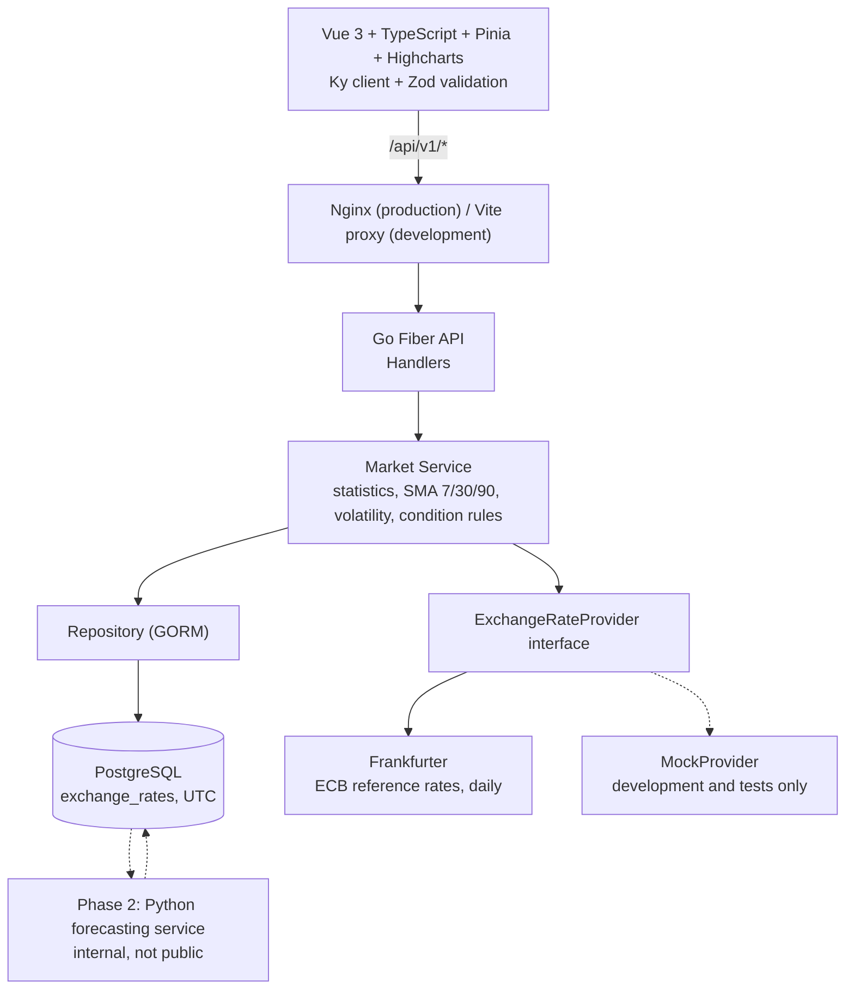

# RdMarket Intelligence

> USD/IDR market monitoring and statistical analysis platform. Phase 1: Market Monitoring.

RdMarket Intelligence is a terminal-style dashboard for monitoring the USD to Indonesian Rupiah (USD/IDR) exchange rate. The backend periodically ingests exchange-rate observations from an external provider, validates and deduplicates them, stores them in PostgreSQL (UTC), and serves statistics, indicators, and rule-based market-condition labels. The frontend visualizes them with interactive charts.

It is an **analytical monitoring tool**. It reports what the stored data shows. It does not predict the future rate with certainty and does not give financial advice.

---

## 1. Data source and limitations

The default provider is [Frankfurter](https://frankfurter.dev), which serves the European Central Bank (ECB) reference rates.

- **Daily data only.** ECB reference rates are published once per working day (around 16:00 CET). There is no intraday data. Weekends and ECB holidays have no observations. The dashboard shows the latest available daily rate, not a live quote.
- **Cross rate.** ECB publishes rates against the euro. USD/IDR is derived as a cross rate.
- **Reference, not tradable.** ECB reference rates are for information purposes. They are not the rate at which transactions happen.
- **Ranges.** The `1D` range needs intraday data, which this provider does not offer. With a daily provider, short ranges contain few points and the UI must say so instead of showing an empty or invented chart.
- **No fabricated data.** Missing periods are shown as real gaps. Nothing is interpolated, estimated, or generated. If there is not enough history for a statistic, the UI shows "Not enough data".
- **Mock provider.** `MockProvider` exists only for development and tests. It must never run in production and must never be used as a silent fallback when the real provider fails. When it is active, all data is simulated and the UI must say so.

Provider terms of use and rate limits must be checked before any public deployment.

---

## 2. System architecture



Layering rules:

```text
Handler -> Service -> Repository -> Database
Service -> Provider -> External API
```

- Handlers stay thin. Business logic lives in services and pure domain functions.
- The browser talks only to the Go API. Provider credentials never reach the frontend.
- Frontend flow: `Component -> Composable -> Pinia store -> API service -> Ky -> Go API`. Components never call HTTP directly, and chart components receive data as props.

---

## 3. Technology stack

### Frontend

- Vue 3 (Composition API, `<script setup lang="ts">`), TypeScript (strict)
- Vite, Pinia, Vue Router 4
- Highcharts (centralized theme)
- Ky (centralized HTTP client), Zod (runtime validation of every API response)
- Tailwind CSS with CSS-variable design tokens

### Backend

- Go, GoFiber v2, GORM
- PostgreSQL 16

### Infrastructure

- Docker and Docker Compose
- Nginx (production web server and reverse proxy)

Versions are those declared in `go.mod` and `package.json`.

---

## 4. Database

`exchange_rates` stores observations with UTC timestamps.

```sql
CREATE TABLE exchange_rates (
    id SERIAL PRIMARY KEY,
    currency_pair VARCHAR(10) NOT NULL,
    timestamp TIMESTAMP WITH TIME ZONE NOT NULL,
    rate NUMERIC(16, 4) NOT NULL,
    source VARCHAR(64) NOT NULL,
    created_at TIMESTAMP WITH TIME ZONE NOT NULL,
    updated_at TIMESTAMP WITH TIME ZONE NOT NULL
);

-- Indexes for range scans and fast lookups
CREATE INDEX idx_currency_pair ON exchange_rates(currency_pair);
CREATE INDEX idx_timestamp ON exchange_rates(timestamp);
CREATE INDEX idx_pair_time ON exchange_rates(currency_pair, timestamp);

-- Prevents duplicate observations
CREATE UNIQUE INDEX idx_pair_time_source ON exchange_rates(currency_pair, timestamp, source);
```

Conventions:

- Timestamps are stored in UTC. They are converted to Asia/Jakarta (WIB) only for display.
- Rates use `NUMERIC`, never floating point.
- Ingestion is idempotent: re-running it does not create duplicates.

---

## 5. API reference

Base path: `/api/v1`. Every response uses the same envelope:

```json
{
  "data": {},
  "meta": { "generated_at": "2026-09-29T07:52:24Z" },
  "error": null
}
```

Error example:

```json
{
  "data": null,
  "meta": {},
  "error": {
    "code": "DATA_SOURCE_UNAVAILABLE",
    "message": "Market data source is temporarily unavailable"
  }
}
```

| Method | Endpoint                           | Query parameters                                             | Description                                              |
| :----- | :--------------------------------- | :----------------------------------------------------------- | :------------------------------------------------------- |
| `GET`  | `/api/v1/health`                   | none                                                         | Service health and phase metadata                        |
| `GET`  | `/api/v1/market/usdidr/current`    | none                                                         | Latest rate, daily change, previous close, data timestamp |
| `GET`  | `/api/v1/market/usdidr/history`    | `range` (`1D`, `7D`, `1M`, `3M`, `6M`, `1Y`, `5Y`), `start`, `end` | Historical points, with real gaps                        |
| `GET`  | `/api/v1/market/usdidr/statistics` | none                                                         | Changes, 52-week high and low, average, min, max         |
| `GET`  | `/api/v1/market/usdidr/indicators` | `range`                                                      | SMA 7, SMA 30, SMA 90, rolling volatility, condition     |
| `GET`  | `/api/v1/data-sources`             | none                                                         | Provider status, last update, observation count          |

The selected range always triggers an API request. The frontend never filters a large dataset itself.

Status codes: `200` success, `422` invalid parameters, `503` data source or database unavailable.

---

## 6. Statistics, indicators, and market condition

All values are computed deterministically from stored observations. There is no AI-generated text.

### Statistics

- Current rate, previous close, daily change and daily change %
- Weekly and monthly change %
- 52-week high and low
- Average, minimum, and maximum over the selected range

If the stored history does not reach far enough back, the value is shown as "Not enough data".

### Indicators

1. **Simple moving averages** for windows $k \in \{7, 30, 90\}$:

   $$\text{SMA}_k(t) = \frac{1}{k}\sum_{i=0}^{k-1} R(t-i)$$

   Points without enough history are empty, not approximated.

2. **Rolling volatility**: sample standard deviation of daily returns over 30 observations, expressed in percent, not annualized. Return type (percentage or logarithmic): _confirm and document here_.

3. **Daily return** and **weekly return**.

### Market condition rules

Labels come from transparent thresholds. The thresholds live in backend configuration.

| Label               | Rule                                        | Result     |
| :------------------ | :------------------------------------------ | :--------- |
| Short term          | 7-day return $> +0.20\%$                    | `Positive` |
|                     | 7-day return $< -0.20\%$                    | `Negative` |
|                     | otherwise                                   | `Neutral`  |
| 30-day trend        | 30-day cumulative return $> +0.50\%$        | `Upward`   |
|                     | 30-day cumulative return $< -0.50\%$        | `Downward` |
|                     | otherwise                                   | `Sideways` |
| Observed volatility | rolling volatility $< 0.40\%$               | `Low`      |
|                     | rolling volatility $> 1.00\%$               | `High`     |
|                     | otherwise                                   | `Moderate` |

_Descriptive statistics only. Not financial advice._

---

## 7. How to run

### Option A: Docker Compose (recommended)

```bash
git clone <repo-url>
cd rdmarket-intelligence
cp .env.example .env
docker compose up --build
```

| Service    | URL                                    |
| :--------- | :------------------------------------- |
| Frontend   | `http://localhost:3000`                |
| Backend    | `http://localhost:8080/api/v1/health`  |
| PostgreSQL | `localhost:5432` (development only)    |

In production the database port must not be published.

### Option B: native development

Backend:

```bash
cd backend
go test -v ./...
PORT=8080 go run cmd/server/main.go
```

Frontend:

```bash
cd frontend
npm install
npm run dev
```

Open `http://localhost:3000`. A local PostgreSQL instance is required for the backend.

---

## 8. Environment variables

Copy `.env.example` to `.env`. Never commit `.env`. Secrets are read only by the backend.

| Variable                 | Description                                                              |
| :----------------------- | :----------------------------------------------------------------------- |
| `DATABASE_URL`           | PostgreSQL connection string                                             |
| `EXCHANGE_RATE_API_URL`  | Base URL of the exchange-rate provider                                   |
| `EXCHANGE_RATE_API_KEY`  | Provider API key. Leave empty if the provider needs none (Frankfurter does not) |
| `APP_ENV`                | `development`, `test`, or `production`                                   |
| `PORT`                   | Backend HTTP port                                                        |

---

## 9. Testing

```bash
# Backend
cd backend && go test -v ./...

# Frontend
npm run test
npm run type-check
```

Tests use synthetic data only. Covered areas: provider parsing, market service, statistics and indicator calculations, API handlers, repository logic, and frontend schema validation and data transformation.

---

## 10. Forecasting compatibility (Phase 2)

Forecasting is **not** implemented in Phase 1. The architecture is prepared so Phase 2 can be added without changing the market-data core:

```text
PostgreSQL -> Python Forecasting Service -> Forecast tables -> Go API -> Vue dashboard
```

- `exchange_rates` remains the source of truth. The Python service reads it and writes only to its own tables.
- Planned tables: `forecast_jobs`, `forecast_runs`, `forecasts` (point forecast with 80% and 95% intervals), `backtest_runs`, `backtest_predictions`, `model_evaluations`.
- The Python service is internal. Only the Go API is public.
- Planned models: naive, drift, and seasonal-naive baselines, ETS, ARIMA, SARIMA. Prophet and a simple ML baseline are optional and experimental.
- Backtesting uses walk-forward evaluation with MAE, RMSE, MAPE, sMAPE, MASE, directional accuracy, and interval coverage, always compared against the naive baseline.
- The Highcharts theme (`frontend/src/components/charts/theme.ts`) and the Pinia market store are structured so forecast series and interval bands can be added.

Exchange rates are hard to forecast. Models often fail to beat the naive baseline, and the product will say so.

---

## 11. Known gaps

Items to close in the foundation phase (Phase 0), before Phase 2 starts:

- Versioned SQL migrations with up and down files replace automatic GORM schema migration.
- Data-quality columns on `exchange_rates`: `quality_status`, `quality_reason`, `fetched_at`, plus a validation layer (sanity bounds, jump detection, staleness).
- A provider capability model, so the UI knows what the provider supports (for example no intraday).
- OpenAPI specification as the API contract, with a contract check between Go and Zod.
- Minimal admin authentication for state-changing endpoints.
- Environment guard rails: `MockProvider` is refused when `APP_ENV=production`, and a simulated-data banner is shown whenever it is active.
- CI pipeline and end-to-end tests.

---

## 12. Roadmap

- **Phase 0: Foundation.** Migrations, data-quality layer, provider capabilities, OpenAPI contract, authentication, design system, i18n, CI, end-to-end tests.
- **Phase 1: Market Monitoring (current).**
  - USD/IDR ingestion pipeline with deduplication
  - Historical storage and API-driven ranges
  - Terminal-style dashboard, statistics, SMA, volatility
  - Rule-based market condition labels
  - Data-source status
- **Phase 2: Forecasting and Backtesting.**
  - Python forecasting service (internal)
  - Baselines, ETS, ARIMA, SARIMA
  - 80% and 95% prediction intervals
  - Walk-forward backtesting and model leaderboard
- **Phase 3: Economic Indicators.**
  - Bank Indonesia policy rate, US federal funds rate, inflation, and other indicators
  - Point-in-time data with publication lag and revisions
  - Historical co-movement analysis (not causation)
- **Phase 4: Alerts and Market Intelligence.** Delivered together with Phase 3.
  - Threshold, volatility, indicator, and data-health alerts
  - Email and webhook notifications through a reliable outbox
  - Deterministic daily market brief and regime summary
- **Phase 5: Production Monitoring and Optimization.**
  - PgBouncer connection pooling
  - Metrics and dashboards (Prometheus and Grafana)
  - Caching (for example Redis) only if measurements justify it

---

## 13. Product principle

RdMarket Intelligence is an analytical monitoring instrument. It provides factual, backward-looking statistical summaries of exchange-rate data, using terms such as "current trend", "historical movement", and "observed volatility". It does **not** assert certainty about future market behavior, and its labels use transparent, documented criteria.